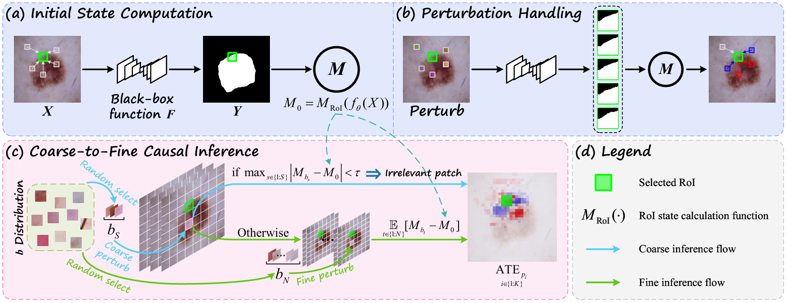

# PdCR

Code for the paper **"Leveraging Causal Reasoning Method for Explaining Medical Image Segmentation Models"**.



---

## Project Structure

We provide two usage modes:  
`main.py` is the main evaluation script used in the paper, which computes PdCR maps for all models on the test set.  
`main_one_image.py` is a quick demo for single-image testing. Users can specify any end-to-end model and a custom RoI to visualize the segmentation behavior.


### Environment Requirements

This project has been tested and runs successfully under the following environment:

- **Python**: 3.8.20
- **PyTorch**: 2.4.1+cu121  
- **Torchvision**: 0.19.1+cu121
- **numpy**: 1.24.4
- **timm**: 0.4.12
- **ninja**: 1.11.1.4
- **jinja2**: 3.14
- **mamba-ssm**: 2.2.2 (If you need to run the Vision Mamba)

The PdCR method itself is lightweight and compatible with mainstream PyTorch versions. It is recommended to use a CUDA driver version compatible with the above libraries.

> ⚠️ Note: Different segmentation models may have additional dependencies.
>
> The environment dependencies vary depending on the segmentation model. We recommend referring to the original papers for each model and finding the corresponding code repositories.
> Please refer to the original papers and corresponding repositories of each model for specific requirements.
---

## main.py


### Step 1: Prepare a trained model  
We provide dataloaders for HAM10000 and FIVES under `seg_model/datasets_`.  
Download these datasets and place them into your own folders, then set the paths in `total_config.py` via the `data_path` field.  
Optionally, modify the model-specific config.  
Use the following command to train any model from `model_zoo`:

```bash
python seg_model/train.py
```

This will save two checkpoints in the model folder:
- `*_latest.pth`: for training resume
- `*_best.pth`: for final evaluation

### Step 2: Prepare intervention blocks  
Use the following command to randomly select test images for PdCR evaluation, and crop the remaining images to generate perturbation blocks:

```bash
python create_PdCR_test_dataset.py
```

We also provide a small set of 1000 blocks for demo usage under the `intervention_patches/` folder.

### Step 3: Run `main.py`  
After training, modify `model_name_list` to select models to test, and set the folder path that stores intervention images.

We provide pre-selected image lists used in the paper under `demo/` as two `.txt` files. These files contain image names and RoI coordinates (top-left corner). Note that these samples come from the original **test** folder of dataset.  
`main.py` will read them as the `coord_file`, but you can also replace them with your own `.txt` file.

We also include the ablation study version of the paper using the `zero_local` mode for comparison.

---

## main_one_image.py

This script only evaluates a single image, but the logic is much simpler and easier to understand.  
We recommend starting by loading a simple UNeXt checkpoint and testing the images provided in the `demo/` folder.

Example:

We provide the checkpoint file for UNeXt in the `demo/` folder. You can easily use it.

```bash
python main_one_image.py \
  --model_ckpt_path demo/unext_HAM10000_best.pth \
  --save_path demo/result_folder \
  --image_stem ISIC_0033556 \
  --top_left_i 72 \
  --top_left_j 88
```
